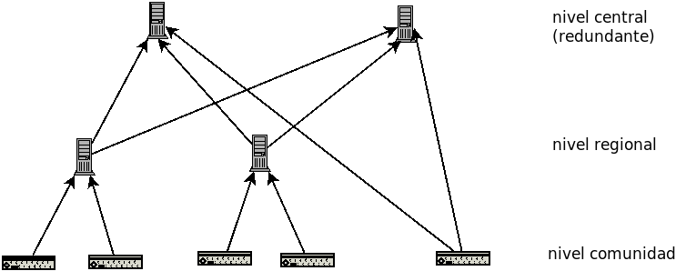

# Arquitectura Prometheus

San: "en principio uno por cada comunidad, otro regional (si es que hay muchas comunidades en la region) y otro mundial por ejemplo. El de la comunidad no tiene la info de la region ni el mundial, solo lo de la propia comunidad. Podriamos poner en el grafico que el nivel central no necesariamente es 1 solo servidor (por ejemplo por redundancia)"

[Prometheus](https://prometheus.io)
